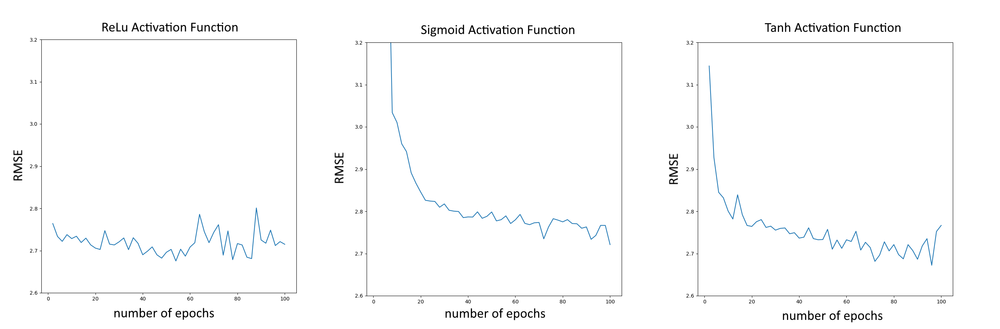

# Neural Networks and Traffic Flow

## Introduction

**Purpose and Project Goal**:  With the increasing popularity of ride sharing apps such as Uber
and Lyft, it is paramount for these companies to determine trends in taxi cab fares in order to
have additional information on the competition. It is also important for ride sharing companies
to analyze the trends in how their customers consume their services. With this in mind, we set
out to build a model to predict the cost of a taxi ride and determine the times of day which have
the greatest price surges.

**The Dataset**: We used a data set on [Kaggle](https://www.kaggle.com/c/new-york-city-taxi-fare-prediction) with information about New York City taxi rides to use for our input features which contained the associated fare values for these rides that we could use for our target output. The data set itself contained millions of rows of data but with limited time and computing power, we chose to randomly extract 20,000 points from the data, with 80% being used for training and 20% being used for testing. The following were the input features:
- pickup_datetime - timestamp value indicating when the taxi ride started.
- pickup_longitude - float for longitude coordinate of where the taxi ride started.
- pickup_latitude - float for latitude coordinate of where the taxi ride started.
- dropoff_longitude - float for longitude coordinate of where the taxi ride ended.
- dropoff_latitude - float for latitude coordinate of where the taxi ride ended.
- passenger_count - integer indicating the number of passengers in the taxi ride.

The target output was the following field:
- fare_amount - float dollar amount of the cost of the taxi ride.

**Overview of the Methodology**: We split this project into four main parts:
1. **Pre-processing the data** - clean and normalize the data entries so they can be effectively fed into models.
2. **Explore Different Models** - research different machine learning models and methodologies before deciding on the optimal methods to use.
3. **Build the Model** - choose and build a model with the necessary parameters (ex. For a Neural Network, determine the number and type of layers as well as the activation functions).
4. **Test the Model and Obtain Insights** - Execute the model on test data and determine the most valuable takeaways from the research.

## Implementation

**The Haversine Function**: The pick-up and drop-off locations are in degrees latitude and longitude. As we want straight-line distance as an input for our neural network, we use the [Haversine function](https://en.wikipedia.org/wiki/Haversine_formula) to find the shortest great-circle distance over the Earth’s surface between the latitude-longitude coordinates of the pick-up and drop-off, with the answer returned in kilometres.

**Cleaning the Data**: We clean the data before feeding it into the neural network to catch incorrectlyentered data. We require that each ride has
- Haversine distance < 30km
- cost < $75
- year ∈ {2001, 2002, . . . , 2019}
We also require for simplicity that each ride has passenger count = 1, and for general use, the model can be retrained with a passenger count of 2, etc.

**Cutting out Manhattan**: Upon graphing pick-up and drop-off locations on a map of New York
City (see figures below), we notice that the Haversine function will be less accurate if a ride
starting on the island of Manhattan does not stay confined to Manhattan. This is because the taxi
will first have to travel to a bridge and then to the drop-off, and the straight-line distance will be
an inaccurate measure of the distance.

To make our model more accurate, albeit at the expense of limiting its use, we restrict our data
set to rides that begin and end in Manhattan. We identified the points A, B, C, and D as the
vertices of a quadrilateral that enclose Manhattan,

- A = (40.693598, −74.043508)
- B = (40.887045, −73.935076)
- C = (40.796631, −73.928354)
- D = (40.709264, −73.977696)

</img>

All points X to the right of the line AB will give det(B − A, X − A) > 0, and all points to the
left side of AB will give det(B − A, X − A) < 0. This is because if X is to the right of AB then
the matrix (B −A, X −A) is a linear transformation which preserves the orientation of the basis
vectors (1, 0) and (0, 1), and if X is to the left of AB then the matrix (B − A, X − A) is a linear
transformation which reverses the orientation of the basis vectors (1, 0) and (0, 1).

We can easily check the determinants of the relevant matrix for each pick-up or drop-off location
X and for each of the four lines of the quadrilateral. If the pick-up and drop-off points of a ride
are within the quadrilateral, then the ride is included in the restricted data set.

**Compiling the Model**: We used the packages Keras and scikitlearn in Python to implement our
neural networks. In order to compile the model we need to specify:
- **the optimizer**: the stochastic gradient descent algorithm we wish to use. We used Adam
(Adaptive Moment Optimization), a standard choice (see the Math section).
- **the loss function**: this measures how different our model’s predicted values are from the
actual values at each step of the training process. We used Mean Squared Error.

**Comparison of Models**: The following figures provide plots of our Basic Simple Linear Model and Basic NN Model (trained and tested on 20,000 points of the unrestricted data set) and our Manhattan Simple Linear Model and Manhattan NN Model (trained and tested on 20,000 points restricted to
Manhattan). Some observations about the graphs of the models:

</img>

</img>

- As predicted, the models become more accurate when the input is restricted to Manhattan
and the RMSE values drop for both the Simple Linear and Neural Network mordels.
- The Simple Linear Models capture a linear relationship between Haversine distance and
fare, but not the more complicated, non-linear dependence of the fare on the time-of-day.
The NN Models capture a linear relationship between fare and distance travelled, but their
graphs also bulge slightly with the time-of-day to account for the dependence of the fare
on the time-of-day. This improvement is reflected by the RMSE value dropping from 4.08
to 3.85 for the basic models and from 2.77 to 2.70 for the Manhattan models.
- The RMSE improves from 3.15 to 2.80 when we restrict our data set to rides that start and
end in Manhattan. As mentioned before, the Haversine distance function becomes more
accurate for rides that are confined to Manhattan, so we expect this improvement.

</img>

**Comparison of Activation Functions**: The figure above gives a comparison of how the RMSE value
developed with the number of epochs for the Relu, tanh and sigmoid activation functions, when
training our Manhattan NN Model. The activation functions all behaved similarly, and we had
no reason to prefer any one in particular and decided to use a tanh activation function.

**Google Maps Distance Matrix API**: We implemented another method of obtaining distance using the Google Maps API which provides the driving distance between two points, as in the map on the right. This is more accurate than the Haversine function, but due to API limits we were only able to obtain the driving distance for 1,000 data point unlike the other models that used 20,000). Even so, we trained the model on a subset of the original data set (not restricted to Manhattan) and obtained a RMSE of 3.08, an improvement over the RMSE of 3.20 for the corresponding Basic Neural Network.

## Insights

We can see the following fare distribution based on the model’s prediction, through the 24 hours of the day:

</img>

Thus, we ge tthe following plot for each distance bracket of the day:

</img>

Most notably, we can make the following observations:
- The **prices surge in the middle of the day**, especially between noon and 5pm.
It is commonly known that rush hour is either earlier in the day, say around 9am or in the
evening, so around 6pm. These travellers are probably more regular travellers travelling to
work, are more likely to use public transport or their own cars. Thus, mid-day price surges
are probably caused more by non-regular travellers or due to unplanned travel.
- The surge is **more pronounced for longer rides** that have a distance of over 5km.
This is potentially due to a basic pricing model with a base fare and a per km charge.
Therefore, as the distance increases, the price increases become more noticeable.

**Future Work**: Although we obtained some interesting insights, we thought about what ways
we can improve upon the model in the future. One approach involves looking into specific data
field trends and using that to better pre-process the data, by generating a data field correlation
heat map to easily see which fields were most correlated. With this added knowledge, more
models with varying data field inputs could be created to find the most optimal specifications for
a machine learning model. Examining the test output and determining the source of higher error
data points could prove useful in adjusting model parameters and further increasing accuracy.

For more details on the model and optimization program, learn more [here](https://github.com/ahujaradhika/nyc-taxi-fare-prediction/blob/master/report.pdf).
